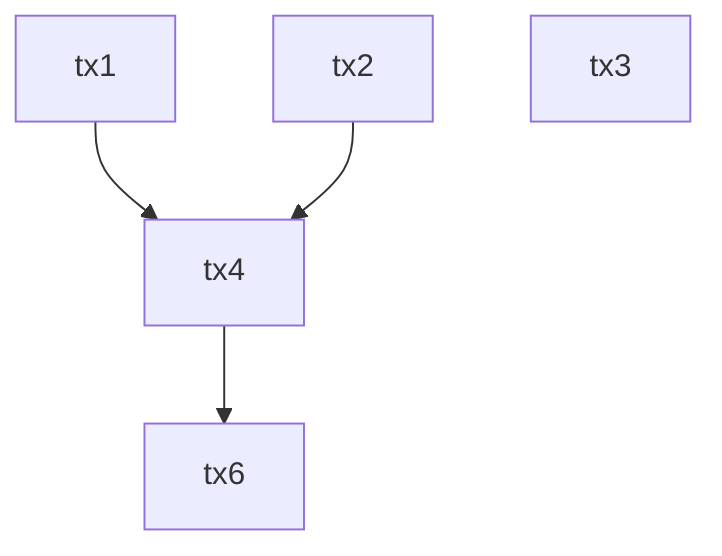

# SuiGraph

**SuiGraph** is an open-source indexing and visualization tool that maps the **execution-level dependency structure** of transactions on the [Sui](https://sui.io) blockchain.

It builds and serves **object-based execution dependency graphs** for each checkpoint, helping developers, infrastructure operators, and researchers gain insight into **transaction parallelism**, **object contention**, and **execution bottlenecks** on Sui.

---

## Features

- 🔍 **Transaction Dependency Graphs**  
  Builds a directed acyclic graph (Graph) of transaction dependencies based on shared object access per checkpoint.

- ⚡ **Parallel Execution Layering**  
  Groups transactions into execution layers based on independent object access — representing parallelizable batches.

- 🌐 **REST API Server**  
  Serves graph data and transaction analysis endpoints for external visualizations and services.

- 🛠 **Lightweight Indexer**  
  Continuously fetches checkpoint and transaction data from a Sui fullnode and stores minimal graph structure.

---

## Why?

Sui's parallel execution capability is enabled by its **object-centric execution model**, not directly by its consensus Graph.  
However, these object dependencies are not visible via traditional explorers or block views.

SuiGraph helps you:

- Understand **which transactions can be executed in parallel**
- Identify **shared-object contention**
- Visually **explain Sui's execution advantage** compared to traditional serial chains

---

## Architecture

```text
                +------------------------+
                |   Sui Fullnode RPC     |
                +------------------------+
                           |
                   Fetch Checkpoint/Txs
                           |
        +------------------v------------------+
        |       Indexer (Dependency Parser)   |
        +------------------+------------------+
                           |
         Store tx-object access, dependencies
                           |
                  +--------v--------+
                  |    Postgres     |
                  +--------+--------+
                           |
                   Serve via REST API
                           |
        +------------------v------------------+
        |           Web API Server            |
        +------------------+------------------+
                           |
                   JSON → Frontend/Dashboard
```

# Key Concepts
Object Dependency Graph
A **directed acyclic graph (Graph)** where:
- Nodes are transaction digests (tx_digest)
- Edges represent object-level dependency (i.e., tx A → tx B means B reads or writes an object modified by A)
- Layers represent parallelizable transaction groups

Parallel Execution ≠ Graph Consensus
Sui's parallelism comes from its object-centric execution model.
Narwhal-Bullshark Graph consensus determines ordering of shared-object transactions efficiently, but does not provide parallelism itself.

# API Overview
Method | Endpoint | Description
GET | /checkpoint/:id/dependency-graph | Returns object-based dependency graph for given checkpoint
GET | /tx/:digest | Returns transaction’s dependencies and dependents
GET | /checkpoint/latest | Returns latest parsed checkpoint and summary
GET | /metrics | (Optional) Graph-level stats (depth, width, parallelism %)

# Example: Parallel Execution Graph


- tx1, tx2, tx3 → parallel
- tx4 depends on tx1 and tx2
- tx6 depends on tx4

# Roadmap
- WebSocket stream support for live DAGs

- Prometheus metrics integration

- Web dashboard (Vue / React + D3)

- Per-object conflict heatmaps

- GraphQL API support

# Terminology Clarification
- Dependency Graph: Execution-layer structure derived from object access patterns
- Graph Consensus: Narwhal-Bullshark’s protocol for sequencing shared-object transactions
- This project is about the former, not the latter.

# License
MIT License

# Contributors
Built by @qj0r9j0vc2 and @heun630.
Contributions and PRs are welcome!